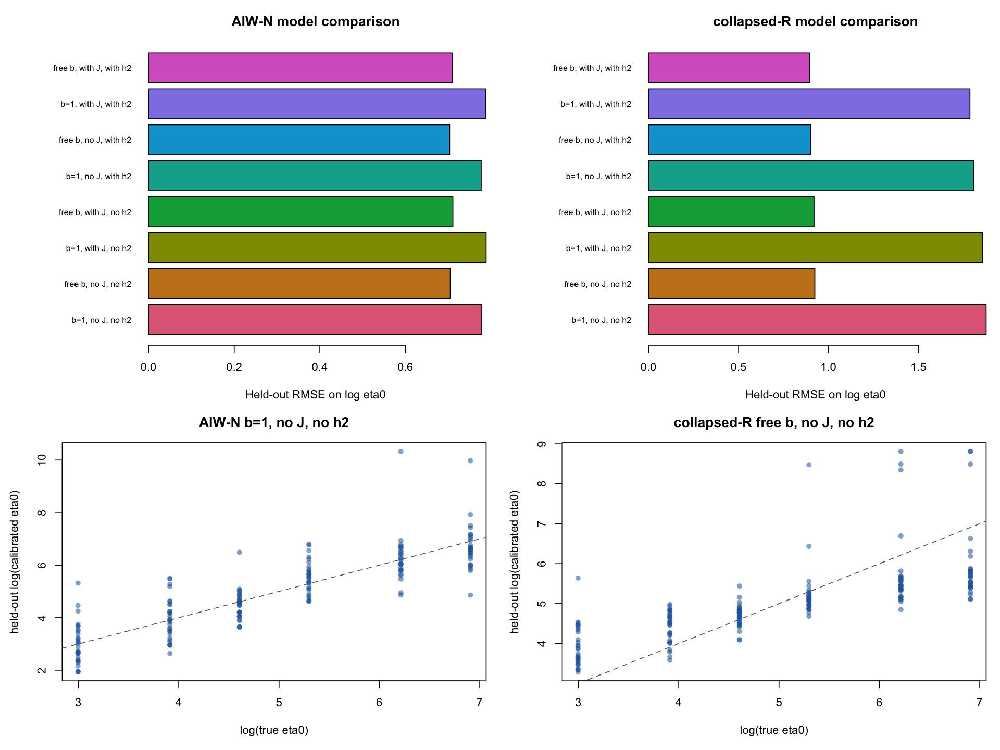

# Calibration of eta0 as a function of J and local h2

The experiment varies J over {100, 250, 500, 1000, 2000}, true eta0 
over {20, 50, 100, 200, 500, 1000}, and local h2 over 
{2e-4, 1e-3, 5e-3}. Each cell uses two independent coalescent 
reference-LD panels. The phenotype contains two weak-LD causal effects 
with fixed 7:3 weights, and the capped lambda grid is searched.

The four requested calibration forms are fitted separately for AIW-N 
and collapsed-R, with J included:

1. b fixed to one, without h2;
2. b estimated, without h2;
3. b fixed to one, with h2; and
4. b estimated, with h2.

The corresponding four no-J baselines are also fitted. These baselines 
test whether allowing calibration to depend on locus size improves 
held-out prediction rather than assuming that it must.

The centered calibration equation is

eta0_cal = 1000 exp(a) (eta0_hat/1000)^b 
             (J/1000)^cJ (h2/1e-3)^ch.

For b=1, exp(a) is the multiplicative correction at J=1000 and 
h2=1e-3. Models without h2 set ch=0. Normal-limit estimates are 
recorded but excluded from finite calibration regressions because they 
require no multiplicative correction.

## Actual-selection model comparison

| method | model | CV_RMSE | CV_MAE | CV_bias | maximum_absolute_true_eta0_bias | bias_at_true_eta0_20 | bias_at_true_eta0_1000 | maximum_absolute_group_bias | reference_multiplier | b | J_exponent | h2_exponent |
| --- | --- | --- | --- | --- | --- | --- | --- | --- | --- | --- | --- | --- |
| AIW-N | free_b_no_J_with_h2 | 0.7034 | 0.5200 | -0.0002 | 0.6339 | 0.4673 | -0.6339 | 0.4854 | 0.7507 | 0.7554 | 0.0000 | 0.0411 |
| AIW-N | free_b_no_J_no_h2 | 0.7049 | 0.5204 | 0.0001 | 0.6344 | 0.4697 | -0.6344 | 0.5495 | 0.7537 | 0.7558 | 0.0000 | 0.0000 |
| AIW-N | free_b_with_J_with_h2 | 0.7099 | 0.5270 | -0.0048 | 0.6316 | 0.4619 | -0.6316 | 0.5063 | 0.7307 | 0.7573 | -0.0444 | 0.0395 |
| AIW-N | free_b_with_J_no_h2 | 0.7110 | 0.5283 | -0.0043 | 0.6317 | 0.4644 | -0.6317 | 0.5710 | 0.7325 | 0.7577 | -0.0465 | 0.0000 |
| AIW-N | fixed_b_no_J_with_h2 | 0.7771 | 0.5655 | -0.0007 | 0.2424 | 0.0022 | -0.2054 | 0.4920 | 1.2959 | 1.0000 | 0.0000 | 0.0380 |
| AIW-N | fixed_b_no_J_no_h2 | 0.7784 | 0.5635 | -0.0004 | 0.2437 | 0.0051 | -0.2068 | 0.5553 | 1.2996 | 1.0000 | 0.0000 | 0.0000 |
| AIW-N | fixed_b_with_J_with_h2 | 0.7878 | 0.5732 | -0.0085 | 0.2307 | -0.0005 | -0.2091 | 0.5236 | 1.2378 | 1.0000 | -0.0654 | 0.0358 |
| AIW-N | fixed_b_with_J_no_h2 | 0.7887 | 0.5718 | -0.0079 | 0.2322 | 0.0026 | -0.2102 | 0.5864 | 1.2395 | 1.0000 | -0.0673 | 0.0000 |
| collapsed-R | free_b_with_J_with_h2 | 0.8949 | 0.6949 | -0.0010 | 0.9134 | 0.8504 | -0.9134 | 0.6771 | 0.3964 | 0.3973 | 0.1029 | 0.1719 |
| collapsed-R | free_b_no_J_with_h2 | 0.9002 | 0.6937 | 0.0067 | 0.9198 | 0.8734 | -0.9198 | 0.7645 | 0.3636 | 0.3927 | 0.0000 | 0.1699 |
| collapsed-R | free_b_with_J_no_h2 | 0.9195 | 0.7252 | -0.0001 | 0.9584 | 0.9064 | -0.9584 | 0.8883 | 0.3777 | 0.3779 | 0.0979 | 0.0000 |
| collapsed-R | free_b_no_J_no_h2 | 0.9240 | 0.7261 | 0.0081 | 0.9631 | 0.9284 | -0.9631 | 0.9686 | 0.3480 | 0.3738 | 0.0000 | 0.0000 |
| collapsed-R | fixed_b_with_J_with_h2 | 1.7859 | 1.1568 | -0.0120 | 0.8663 | -0.8663 | 0.5513 | 1.5872 | 1.7896 | 1.0000 | 0.2591 | 0.4327 |
| collapsed-R | fixed_b_no_J_with_h2 | 1.8067 | 1.1453 | 0.0000 | 0.8543 | -0.8543 | 0.5633 | 1.8256 | 1.4782 | 1.0000 | 0.0000 | 0.4327 |
| collapsed-R | fixed_b_with_J_no_h2 | 1.8560 | 1.0858 | -0.0120 | 0.8663 | -0.8663 | 0.5513 | 2.1753 | 1.7896 | 1.0000 | 0.2591 | 0.0000 |
| collapsed-R | fixed_b_no_J_no_h2 | 1.8760 | 1.0584 | -0.0000 | 0.8543 | -0.8543 | 0.5633 | 2.4138 | 1.4782 | 1.0000 | 0.0000 | 0.0000 |

## Recommended models and coefficients

| method | recommendation | model | reference_multiplier | b | J_exponent | h2_exponent | CV_RMSE | CV_MAE | CV_bias |
| --- | --- | --- | --- | --- | --- | --- | --- | --- | --- |
| AIW-N | minimum_CV_RMSE | free_b_no_J_with_h2 | 0.7507 | 0.7554 | 0.0000 | 0.0411 | 0.7034 | 0.5200 | -0.0002 |
| AIW-N | one_SE_parsimonious | fixed_b_no_J_no_h2 | 1.2996 | 1.0000 | 0.0000 | 0.0000 | 0.7784 | 0.5635 | -0.0004 |
| collapsed-R | minimum_CV_RMSE | free_b_with_J_with_h2 | 0.3964 | 0.3973 | 0.1029 | 0.1719 | 0.8949 | 0.6949 | -0.0010 |
| collapsed-R | one_SE_parsimonious | free_b_no_J_no_h2 | 0.3480 | 0.3738 | 0.0000 | 0.0000 | 0.9240 | 0.7261 | 0.0081 |

The minimum-RMSE recommendation is the model with the smallest pooled 
five-fold held-out log-RMSE. The one-standard-error recommendation is 
the least complex model within one standard error of the best model's 
mean fold RMSE. The latter is the default recommendation for discussion.
All observations sharing a reference-LD panel are assigned to the same 
fold, so validation does not reuse R0 across training and testing.

## Interpretation before locking the calibration

For AIW-N, the one-standard-error rule selects a constant multiplier of 1.2996: eta0_cal = 1.2996 eta0_hat. Neither J nor h2 is retained. 
The free-b models lower held-out RMSE, but largely by shrinking estimates 
toward the center of the simulated eta0 grid. This creates appreciably 
larger conditional bias at true eta0=20 and 1000. For a transportable 
multiplicative correction, the constant AIW-N model is therefore the 
preferred candidate for the next downstream check.

For collapsed-R, the predictive one-standard-error model is eta0_cal = 1000 x 0.3480 x (eta0_hat/1000)^0.3738, with neither J nor h2 retained. It crosses the identity line at eta0_hat approximately 185.3 and downscales larger estimates.
That shrinkage map has the best average predictive performance, but it is not equivalent to the intended underestimation correction. The simple collapsed-R multiplier from this design is 1.4782, close to the previously tested value 1.537, but its log-RMSE is much worse because the joint lambda-eta0 profile occasionally produces very large estimates. I therefore record both values and do not automatically replace 1.537 before examining downstream power and coverage.

Thus the current release candidates are: AIW-N with constant 1.2996; 
and, for collapsed-R, either the predictive free-b map above or the 
already validated multiplicative correction 1.537. The latter choice 
requires a methodological decision, not another regression criterion.

Detailed coefficients, cross-validation predictions, boundary rates, 
and calibration values over the design grid are saved beside this report.
