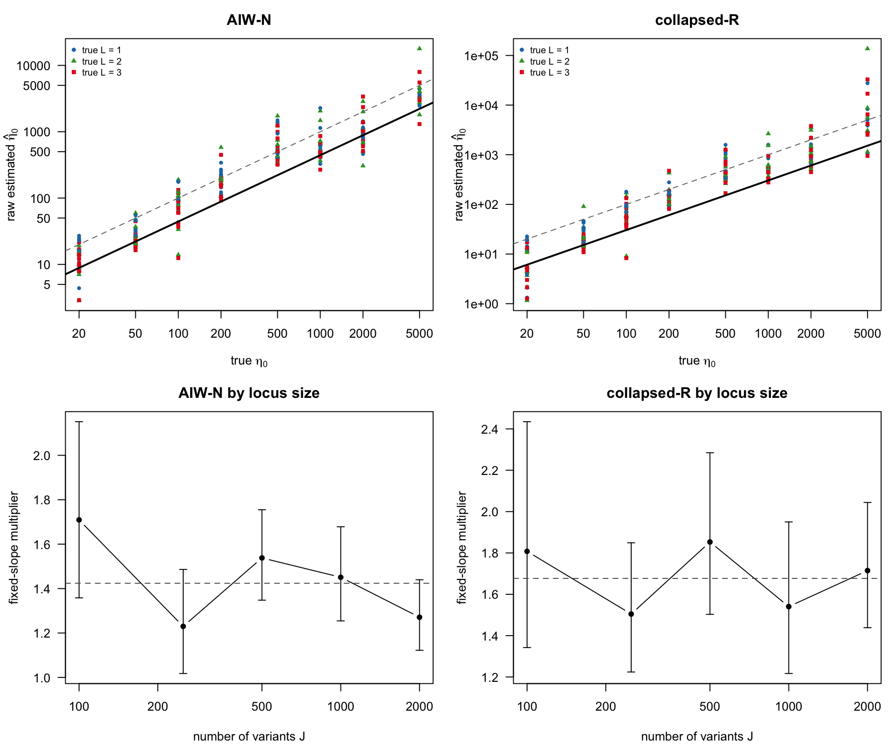

# Coalescent SuSiE-IW calibration across true effect counts

The design contains 240 datasets: J in {100, 250, 500, 1000, 2000}, two independent coalescent reference panels per J, true eta0 in {20, 50, 100, 200, 500, 1000, 2000, 5000}, and true L in {1, 2, 3}. The generating model fixes h2=1e-3, N=200,000, N0=2,000, and lambda_true=1e-3.

The primary model fixes the coefficient of log(raw eta0) to one:

log(true eta0) = log(multiplier) + log(raw estimated eta0).

| method | multiplier | 95% CI | CV RMSE | J exponent | J exponent 95% CI |
| --- | ---: | ---: | ---: | ---: | ---: |
| AIW-N | 1.4240 | 1.3210--1.5350 | 0.5796 | -0.0596 | -0.1318--0.0126 |
| collapsed-R | 1.6768 | 1.5160--1.8547 | 0.7771 | -0.0120 | -0.1097--0.0858 |

The J model adds gamma log(J/500). Its cross-validated RMSE change relative to the constant model is:

- AIW-N: +0.0047
- collapsed-R: +0.0024

Multipliers stratified by true L:

| method | true L | multiplier | 95% CI | finite fits |
| --- | ---: | ---: | ---: | ---: |
| AIW-N | 1 | 1.2881 | 1.1444--1.4497 | 76 |
| AIW-N | 2 | 1.3979 | 1.2165--1.6063 | 77 |
| AIW-N | 3 | 1.6066 | 1.4160--1.8228 | 75 |
| collapsed-R | 1 | 1.4903 | 1.2781--1.7379 | 78 |
| collapsed-R | 2 | 1.6366 | 1.3521--1.9809 | 76 |
| collapsed-R | 3 | 1.9389 | 1.6317--2.3040 | 76 |

